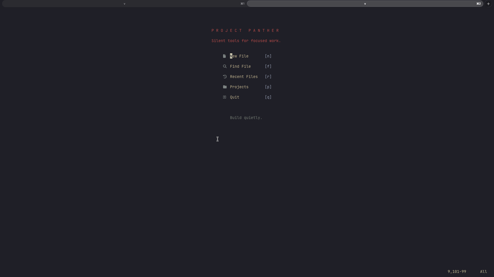
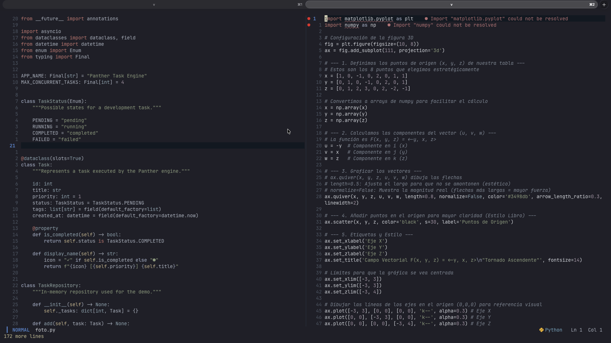
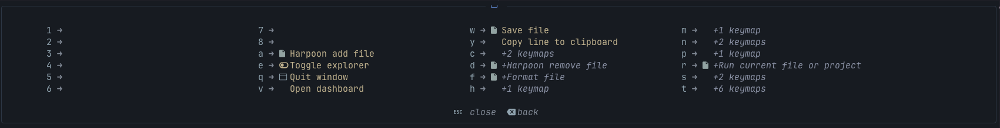

<div align="center">

# 🐆 nvim-cova

### A fast, modular and minimal Neovim configuration built for software development.


</div>

---

## About

**nvim-cova** is my personal Neovim development environment.

It was built from scratch with Lua and focuses on maintaining a balance between:

- Performance
- Productivity
- Modularity
- Minimalism
- Manual control

The configuration provides IDE-like functionality while preserving the speed and flexibility of a terminal-based workflow.

It is primarily designed for development with **Python**, **C**, **C++**, **Java**, **Rust**, **JavaScript**, **TypeScript**, **HTML** and **SQL**.

---

## Features

- Fast startup time of approximately **70 ms**
- Modular Lua configuration
- Plugin management with **lazy.nvim**
- Language Server Protocol support
- Intelligent autocompletion
- Syntax highlighting powered by Treesitter
- Automatic code formatting
- Fuzzy file and text searching
- Integrated terminal
- File explorer and filesystem editing
- Git integration
- Diagnostics and references interface
- Quick project-file navigation
- Dashboard
- Keybinding discovery menu
- Smart multi-language runner
- Markdown preview and PDF export
- Custom templates for C++, Markdown and LaTeX
- Automatic file saving
- Kanagawa-inspired interface

---

## Preview

<!-- > Screenshots will be added inside the `assets` directory. -->





---

## Main Plugins

| Category | Plugin |
|---|---|
| Plugin manager | [lazy.nvim](https://github.com/folke/lazy.nvim) |
| Theme | [kanagawa.nvim](https://github.com/rebelot/kanagawa.nvim) |
| Status line | [lualine.nvim](https://github.com/nvim-lualine/lualine.nvim) |
| Syntax highlighting | [nvim-treesitter](https://github.com/nvim-treesitter/nvim-treesitter) |
| LSP | [nvim-lspconfig](https://github.com/neovim/nvim-lspconfig) |
| Completion | [blink.cmp](https://github.com/Saghen/blink.cmp) |
| Formatting | [conform.nvim](https://github.com/stevearc/conform.nvim) |
| Fuzzy finder | [telescope.nvim](https://github.com/nvim-telescope/telescope.nvim) |
| Telescope sorter | [telescope-fzf-native.nvim](https://github.com/nvim-telescope/telescope-fzf-native.nvim) |
| File explorer | [nvim-tree.lua](https://github.com/nvim-tree/nvim-tree.lua) |
| Filesystem editor | [oil.nvim](https://github.com/stevearc/oil.nvim) |
| Terminal | [toggleterm.nvim](https://github.com/akinsho/toggleterm.nvim) |
| Diagnostics | [trouble.nvim](https://github.com/folke/trouble.nvim) |
| Navigation | [harpoon](https://github.com/ThePrimeagen/harpoon) |
| Git signs | [gitsigns.nvim](https://github.com/lewis6991/gitsigns.nvim) |
| Git commands | [vim-fugitive](https://github.com/tpope/vim-fugitive) |
| Dashboard | [dashboard-nvim](https://github.com/nvimdev/dashboard-nvim) |
| Keybinding menu | [which-key.nvim](https://github.com/folke/which-key.nvim) |
| TODO highlighting | [todo-comments.nvim](https://github.com/folke/todo-comments.nvim) |
| Indentation guides | [mini.indentscope](https://github.com/echasnovski/mini.indentscope) |
| Java support | [nvim-jdtls](https://github.com/mfussenegger/nvim-jdtls) |

---

## Project Structure

```text
.
├── init.lua
├── lazy-lock.json
└── lua
    ├── core
    │   ├── autocmds.lua
    │   ├── keymaps.lua
    │   └── options.lua
    │
    └── plugins
        ├── blink.lua
        ├── conform.lua
        ├── dashboard.lua
        ├── fugitive.lua
        ├── gitsigns.lua
        ├── harpoon.lua
        ├── jdtls.lua
        ├── lsp.lua
        ├── lualine.lua
        ├── mini-indentscope.lua
        ├── nvimtree.lua
        ├── oil.lua
        ├── telescope.lua
        ├── theme.lua
        ├── todo-comments.lua
        ├── toggleterm.lua
        ├── treesitter.lua
        ├── trouble.lua
        └── which-key.lua
```

The exact plugin filenames may change as the configuration continues evolving.

---

## Requirements

Before installing nvim-cova, make sure the following tools are available:

### Required

- Neovim `0.12+`
- Git
- A terminal with true-color support
- A Nerd Font

### Recommended

- [Ghostty](https://ghostty.org/)
- JetBrainsMono Nerd Font
- [ripgrep](https://github.com/BurntSushi/ripgrep)
- [fd](https://github.com/sharkdp/fd)
- Node.js
- Python 3
- A C/C++ compiler
- Rust toolchain
- Java Development Kit
- LaTeX
- Pandoc

On macOS, several dependencies can be installed using Homebrew:

```bash
brew install neovim git ripgrep fd node python rust openjdk pandoc
```

A C/C++ compiler can also be installed with:

```bash
brew install gcc
```

---

## Installation

### 1. Back up your current configuration

```bash
mv ~/.config/nvim ~/.config/nvim.backup
```

You can also back up Neovim's local data:

```bash
mv ~/.local/share/nvim ~/.local/share/nvim.backup
mv ~/.local/state/nvim ~/.local/state/nvim.backup
mv ~/.cache/nvim ~/.cache/nvim.backup
```

### 2. Clone nvim-cova

```bash
git clone https://github.com/itscovart/nvim-cova.git ~/.config/nvim
```

### 3. Start Neovim

```bash
nvim
```

On the first launch, `lazy.nvim` will install the configured plugins automatically.

You can manually check the plugin installation with:

```vim
:Lazy
```

---

## Updating

Update the repository:

```bash
cd ~/.config/nvim
git pull
```

Then update the plugins from Neovim:

```vim
:Lazy update
```

---

## Language Support

nvim-cova is configured for development in several languages.

| Language | Main tooling |
|---|---|
| Python | Pyright, Black |
| C | Clangd |
| C++ | Clangd |
| Java | JDTLS |
| Rust | rust-analyzer |
| JavaScript | TypeScript Language Server |
| TypeScript | TypeScript Language Server |
| HTML | HTML and Emmet language servers |
| SQL | SQL language server |
| Lua | Lua Language Server |

Language servers and formatters must be installed separately when they are not already available on the system.

---

## Keybindings

The leader key is:

```text
Space
```

Press `<leader>` and wait briefly to open the **Which-Key** menu and discover the available mappings.

### General

| Keybinding | Action |
|---|---|
| `<leader>w` | Save current file |
| `<leader>q` | Close current window |
| `<leader>e` | Toggle file explorer |
| `<leader>r` | Run current file |
| `<leader>v` | Open dashboard |
| `<C-h>` | Move to the window on the left |
| `<C-j>` | Move to the window below |
| `<C-k>` | Move to the window above |
| `<C-l>` | Move to the window on the right |

### Telescope

| Keybinding | Action |
|---|---|
| `<leader>ff` | Find files |
| `<leader>fg` | Search text with Live Grep |
| `<leader>fb` | Search open buffers |
| `<leader>fh` | Search help tags |
| `<leader>fk` | Search keybindings |

### Diagnostics

| Keybinding | Action |
|---|---|
| `<leader>xx` | Open Trouble |
| `<leader>xd` | Show buffer diagnostics |
| `<leader>xq` | Open quickfix list |
| `<leader>xl` | Open location list |

### Markdown

nvim-cova includes a custom Markdown workflow with:

- Markdown preview
- Automatic saving
- Markdown templates
- Markdown-to-PDF conversion
- LaTeX support through Pandoc and XeLaTeX

The exact mappings can be viewed through Which-Key or Telescope:

```vim
:Telescope keymaps
```

---

## Smart Runner

nvim-cova includes a custom runner that detects the current file type and executes the appropriate command.

The runner is available through:

```text
<leader>r
```

It is intended to support workflows such as:

- Running Python scripts
- Compiling and running C programs
- Compiling and running C++ programs
- Running JavaScript and TypeScript
- Executing Rust projects
- Running Java code

Some languages may require compilers, interpreters or project tools to be installed separately.

---

## Markdown and PDF Workflow

The configuration includes utilities for writing academic documents directly from Neovim.

Supported functionality includes:

- Markdown templates
- LaTeX templates
- Live Markdown preview
- Local images
- PDF generation with Pandoc
- XeLaTeX as the PDF engine
- Custom document templates

The required external tools are:

```bash
brew install pandoc
```

A LaTeX distribution must also be installed, such as MacTeX.

---

## Ghostty Configuration

nvim-cova is designed to work especially well with Ghostty and JetBrainsMono Nerd Font.

Example Ghostty configuration:

```ini
# Font
font-family = JetBrainsMono Nerd Font
font-size = 15

# Cursor
cursor-style = block
cursor-style-blink = true

# Kanagawa-inspired colors
background = #1f1f28
foreground = #dcd7ba

# Transparency
background-opacity = 0.90
background-blur-radius = 20

# Window spacing
window-padding-x = 12
window-padding-y = 12

# Window behavior
window-decoration = true
window-save-state = always
window-vsync = true

# Interaction
copy-on-select = clipboard
mouse-scroll-multiplier = 1
confirm-close-surface = false
```

The Ghostty configuration file is normally located at:

```text
~/.config/ghostty/config
```

---

## Performance

nvim-cova has a measured startup time of approximately:

```text
71 ms
```

This value was obtained using Lazy.nvim's startup profiler:

```vim
:Lazy profile
```

Startup time can vary depending on the machine, installed language servers and plugin state.

The configuration favors a practical balance between fast startup and immediate availability of frequently used tools.

---

## Design Philosophy

### Performance

The editor should start quickly and remain responsive during real development work.

### Productivity

Every plugin should solve an actual problem instead of being included only for appearance.

### Minimalism

The interface should remain clean and avoid unnecessary visual noise.

### Modularity

Core settings, keybindings, autocmds and plugins are separated into focused Lua modules.

### Control

Automations should help the workflow without hiding what the editor is doing.

---

## Roadmap

nvim-cova is already usable as a complete daily development environment.

Possible future improvements include:

- [ ] Add repository screenshots
- [ ] Add an automated installation script
- [ ] Improve project-session management
- [ ] Add integrated testing support
- [ ] Add debugging support
- [ ] Expand documentation for custom commands
- [ ] Create tagged releases
- [ ] Add Linux installation instructions

---

## Contributing

This is primarily a personal configuration, but suggestions and improvements are welcome.

Feel free to open an issue or submit a pull request.

---

## License

This project is distributed under the MIT License.

See the [`LICENSE`](LICENSE) file for more information.

---

<div align="center">

Built with Lua, Neovim and many hours of configuration.

### 🐆 nvim-cova

**Fast. Modular. Minimal.**

</div>
